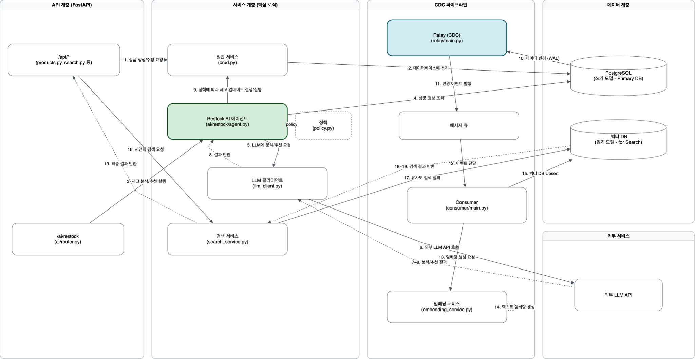
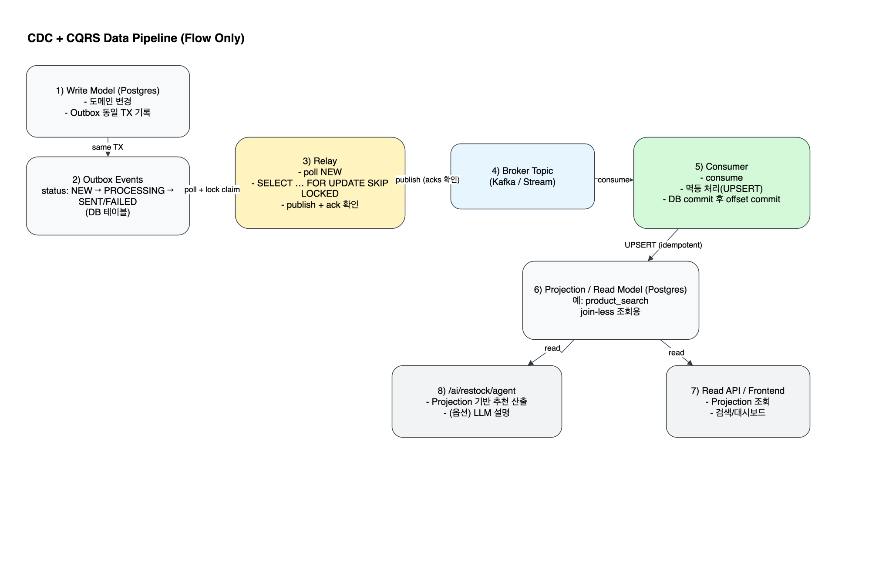

# StackOps (Mini CDC / CQRS) — 재고/상품 운영용 CDC + Projection 시스템

상품/재고 운영에서 **쓰기(정규화 DB)** 와 **읽기(검색/집계/화면)** 요구가 충돌하는 문제를 해결하기 위해  
**Mini CDC + CQRS(Write/Read 분리) + Projection(Read Model)** 구조를 설계·구현한 프로젝트입니다.

- 핵심: **쓰기 DB의 변경을 이벤트로 표준화(Outbox)** 하고, **읽기 모델(Projection)** 을 별도로 유지해 검색/집계 성능과 확장성을 확보합니다.
- 목표: “조인/집계 때문에 느려지는 화면”을 **Projection 조회**로 바꾸고, 변경은 이벤트로 **증분 갱신**합니다.

✅ **Outbox 기반 CDC**: 도메인 변경 캡처 → Relay/Consumer로 Projection **증분 동기화**  
✅ **운영 내구성**: Relay 락 선점 + Consumer 멱등(UPSERT) + 재시도/격리로 중복/재처리에도 일관성 유지  
✅ **의사결정 지원**: `/ai/restock/agent`에서 **추천-only 재입고 리포트(요약/정렬/trace + 선택적 LLM 설명)** 제공

---

## Demo
- Frontend: `http://localhost:3000`
- API Docs (Swagger): `http://localhost:8000/docs`

**Quick Try**
1) `docker compose up -d --build`  
2) 로그인 후 상품/재고 데이터를 생성/변경  
3) Projection 기반 검색/대시보드 화면 확인  
4) `/ai/restock/agent`로 재입고 추천 리포트 조회

---

## Architecture



### Flow
- Next.js UI → FastAPI(API)
- Write Model 변경(상품/재고) → **Outbox(동일 트랜잭션 기록)**
- Relay → Outbox poll + lock 선점 → 이벤트 발행(내부 큐/스트림)
- Consumer → 이벤트 소비 → Projection(Read Model) **UPSERT 갱신**
- UI/검색 API는 Projection 조회(조인 최소화)
- `/ai/restock/agent` → 추천 계산 + 요약/정렬/trace (+ optional LLM explanation)

> 확장 경로(선택): Outbox → Relay → (Kafka 같은 스트림) → Consumer

### CDC / Projection Pipeline (diagram)



## Key Features

### 1) CQRS + Projection(Read Model)
- Write/Read 모델 분리, 변경 이벤트 기반으로 `product_search` 등 Projection을 **증분 갱신**
- 화면/검색 API를 Projection 조회로 전환 → **조인 최소화/없는 구조**로 읽기 성능 개선

### 2) Outbox 패턴으로 이벤트 일관성 보장
- 도메인 변경과 `outbox_events` 기록을 **동일 트랜잭션으로 커밋**
- Relay는 상태 머신(NEW → PROCESSING → SENT/FAILED) 기반 발행  
  → “DB는 됐는데 이벤트가 없음” 리스크 감소

### 3) Relay 동시성 안전 처리 + 운영 내구성
- `SELECT ... FOR UPDATE SKIP LOCKED` 기반 **락 선점**으로 다중 Relay 경쟁/중복 처리 방지
- 실패 사유/재시도 관리 + stuck PROCESSING 복구(reaper, 선택)로 운영 복구성 강화

### 4) 멱등 Consumer + Commit 규칙
- Projection 갱신을 **UPSERT**로 처리 → 중복/재처리에도 결과 동일(멱등)
- DB 반영 성공 후 ack/commit → 실패 시 재처리로 자동 복구 가능

### 5) Restock Agent (recommend-only)
- 판매량/임계값 기반 추천을 **요약(needCount/totalIn/byReason) · 정렬(topNeeds) · trace(근거)** 형태로 제공
- `explain_llm=true` 옵션 시 LLM으로 품목별 1줄 요약/주의사항 생성(키 없으면 fallback)

### 6) (옵션) CSV 기반 스냅샷 동기화 + 이벤트 재사용
- CSV 업로드를 스냅샷 반영으로 시작하고, 반영 과정 변경 이벤트(Outbox)를 알림/검색/추천에 재사용 가능
- 초기 단순 폴링/SSE → 규모 증가 시 Redis Pub/Sub/스트림으로 확장 고려

---

## Tech Stack

### Frontend
- Next.js / React / TypeScript
- (옵션) TailwindCSS / shadcn/ui

### Backend
- FastAPI / Python
- SQLAlchemy
- JWT Auth

### Data / Messaging
- PostgreSQL (Write Model + Projection)
- Redis (cache/aux)
- (선택) Kafka 등 스트림으로 확장 가능

### Infra
- Docker / Docker Compose

---

## Database

### ERD (diagram)
<!-- TODO: ERD 이미지 넣기 -->
<!-- 예: docs/stackops-erd.png -->
<!--  -->

### Tables (v1)
- `users`: 사용자
- `products`: 상품(Write Model)
- `stock_history`: 재고 변경 이력
- `outbox_events`: CDC Outbox 이벤트 테이블
- `product_search` 등: Projection(Read Model)
- `restock_idempotency`: 실행형 엔드포인트 멱등/재사용(운영 내구성)

---

## API Overview

### 1) Health / Docs
- `GET /health`
- `GET /docs`

### 2) Auth
- `POST /auth/login`

### 3) Read Model (Projection)
- `GET /search/products` (필터/정렬/페이지네이션: Projection 기반)
- `GET /search/products/{id}` (Projection 기반)

### 4) Restock Agent (recommend-only)
- `POST /ai/restock/agent?dry_run=true`
- `POST /ai/restock/agent?dry_run=true&explain_llm=true`

---

## Reliability Notes (장애/복구)
- Relay 중단 → Outbox(NEW) 누적 → 재기동 시 이어서 처리
- Consumer 중단 → 이벤트 누적 → 재기동 시 Projection 추격
- 중복 처리/재처리 → Consumer UPSERT 멱등으로 결과 동일
- stuck PROCESSING → 일정 시간 초과 시 NEW로 되돌리는 reaper(선택)로 복구

---

## Run Locally

### 1) 전체 실행 (Docker Compose)
```bash
docker compose up -d --build


