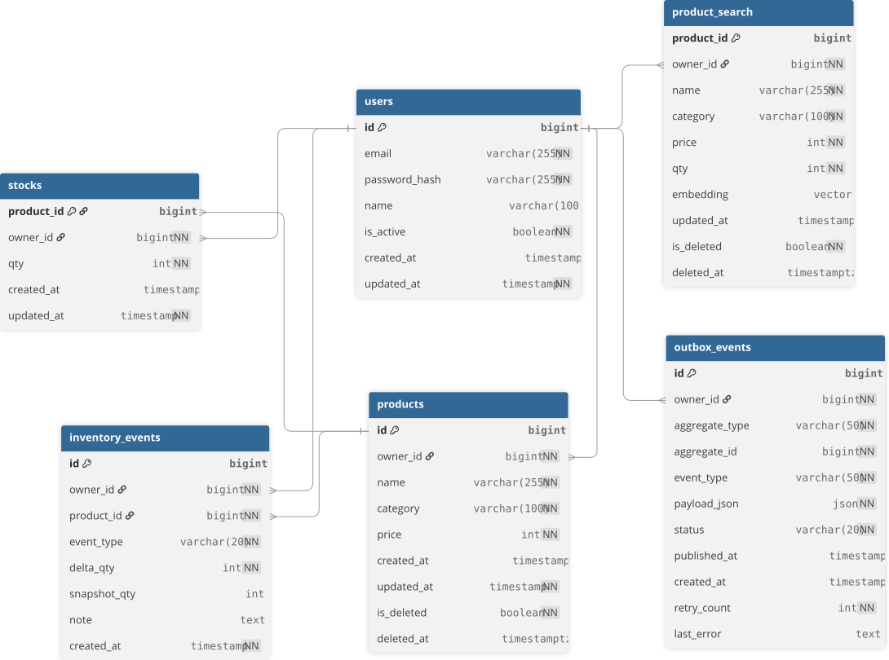

# StockOps (Mini CDC / CQRS) — 재고/상품 운영용 CDC + Projection 시스템

상품/재고 운영에서 **쓰기(정규화 DB)** 와 **읽기(검색/집계/화면)** 요구가 충돌하는 문제를 해결하기 위해  
**Mini CDC + CQRS(Write/Read 분리) + Projection(Read Model)** 구조를 설계·구현한 프로젝트입니다.

- 핵심: **쓰기 DB의 변경을 이벤트로 표준화(Outbox)** 하고, **읽기 모델(Projection)** 을 별도로 유지해 검색/집계 성능과 확장성을 확보합니다.
- 목표: “조인/집계 때문에 느려지는 화면”을 **Projection 조회**로 바꾸고, 변경은 이벤트로 **증분 갱신**합니다.

✅ **Outbox 기반 CDC**: 도메인 변경 캡처 → Relay/Consumer로 Projection **증분 동기화**  
✅ **운영 내구성**: Relay 락 선점 + Consumer 멱등(UPSERT) + 재시도/격리로 중복/재처리에도 일관성 유지  
✅ **의사결정 지원**: `/ai/restock/agent`에서 **추천-only 재입고 리포트(요약/정렬/trace + 선택적 LLM 설명)** 제공

---

## Demo
- Frontend: `http://localhost:3000`
- API Docs (Swagger): `http://localhost:8000/docs`

**Quick Try**
1) `docker compose up -d --build`  
2) 로그인 후 상품/재고 데이터를 생성/변경  
3) Projection 기반 검색/대시보드 화면 확인  
4) `/ai/restock/agent`로 재입고 추천 리포트 조회

---

## Architecture


### Flow
- Next.js UI → FastAPI(API)
- Write Model 변경(상품/재고) → **Outbox(동일 트랜잭션 기록)**
- Relay → Outbox poll + lock 선점 → 이벤트 발행(내부 큐/스트림)
- Consumer → 이벤트 소비 → Projection(Read Model) **UPSERT 갱신**
- UI/검색 API는 Projection 조회(조인 최소화)
- `/ai/restock/agent` → 추천 계산 + 요약/정렬/trace (+ optional LLM explanation)

> 확장 경로(선택): Outbox → Relay → (Kafka 같은 스트림) → Consumer

### CDC / Projection Pipeline (diagram)


## Key Features

### 1) CQRS + Projection(Read Model)
- Write/Read 모델 분리, 변경 이벤트 기반으로 `product_search` 등 Projection을 **증분 갱신**
- 화면/검색 API를 Projection 조회로 전환 → **조인 최소화/없는 구조**로 읽기 성능 개선

### 2) Outbox 패턴으로 이벤트 일관성 보장
- 도메인 변경과 `outbox_events` 기록을 **동일 트랜잭션으로 커밋**
- Relay는 상태 머신(NEW → PROCESSING → SENT/FAILED) 기반 발행  
  → “DB는 됐는데 이벤트가 없음” 리스크 감소

### 3) Relay 동시성 안전 처리 + 운영 내구성
- `SELECT ... FOR UPDATE SKIP LOCKED` 기반 **락 선점**으로 다중 Relay 경쟁/중복 처리 방지
- 실패 사유/재시도 관리 + stuck PROCESSING 복구(reaper, 선택)로 운영 복구성 강화

### 4) 멱등 Consumer + Commit 규칙
- Projection 갱신을 **UPSERT**로 처리 → 중복/재처리에도 결과 동일(멱등)
- DB 반영 성공 후 ack/commit → 실패 시 재처리로 자동 복구 가능

### 5) Restock Agent (recommend-only)
- 판매량/임계값 기반 추천을 **요약(needCount/totalIn/byReason) · 정렬(topNeeds) · trace(근거)** 형태로 제공
- `explain_llm=true` 옵션 시 LLM으로 품목별 1줄 요약/주의사항 생성(키 없으면 fallback)

### 6) (옵션) CSV 기반 스냅샷 동기화 + 이벤트 재사용
- CSV 업로드를 스냅샷 반영으로 시작하고, 반영 과정 변경 이벤트(Outbox)를 알림/검색/추천에 재사용 가능
- 초기 단순 폴링/SSE → 규모 증가 시 Redis Pub/Sub/스트림으로 확장 고려


### 7) Slack Integration (OAuth + Notifications)
- Slack OAuth로 워크스페이스에 앱을 연결해, 운영 이벤트/리포트를 채널로 전달할 수 있습니다.
- (예) 재고 부족/재입고 추천 결과를 Slack으로 공유, 운영자가 바로 의사결정/조치 가능
- OAuth 완료 후 워크스페이스 단위 토큰/설정을 저장하고, API가 Slack API로 메시지를 전송합니다.

---

## Tech Stack

### Frontend
- Next.js / React / TypeScript
- (옵션) TailwindCSS / shadcn/ui

### Backend
- FastAPI / Python
- SQLAlchemy
- JWT Auth

### Data / Messaging
- PostgreSQL (쓰기 모델 + 읽기 모델 일부)
- Apache Kafka (데이터 스트리밍)

### Infra
- Docker / Docker Compose

---

## Database

### ERD (diagram)
<!-- TODO: ERD 이미지 넣기 -->
<!-- 예: docs/stackops-erd.png -->


### Tables (v1)
- `users`: 사용자
- `products`: 상품(Write Model)
- `stock_history`: 재고 변경 이력
- `outbox_events`: CDC Outbox 이벤트 테이블
- `product_search` 등: Projection(Read Model)
- `restock_idempotency`: 실행형 엔드포인트 멱등/재사용(운영 내구성)

---

## API Overview

### 1) Health / Docs
- `GET /health`
- `GET /docs`

### 2) Auth
- `POST /auth/login`

### 3) Read Model (Projection)
- `GET /search/products` (필터/정렬/페이지네이션: Projection 기반)
- `GET /search/products/{id}` (Projection 기반)

### 4) Restock Agent (recommend-only)
- `POST /ai/restock/agent?dry_run=true`
- `POST /ai/restock/agent?dry_run=true&explain_llm=true`


### 5) Slack
- `GET  /slack/oauth/start` : Slack OAuth 시작(Authorize로 리다이렉트)
- `GET  /slack/oauth/callback` : Slack OAuth 콜백(코드 교환 및 설치 완료)
- `POST /slack/notify` : (옵션) 특정 이벤트/리포트를 Slack 채널로 전송
- `GET  /slack/status` : (옵션) 현재 연동 상태 확인

---

## Reliability Notes (장애/복구)
- Relay 중단 → Outbox(NEW) 누적 → 재기동 시 이어서 처리
- Consumer 중단 → 이벤트 누적 → 재기동 시 Projection 추격
- 중복 처리/재처리 → Consumer UPSERT 멱등으로 결과 동일
- stuck PROCESSING → 일정 시간 초과 시 NEW로 되돌리는 reaper(선택)로 복구
  
---


## 📊 Reliability & Performance Tests (운영 검증 요약)

본 프로젝트는 **CDC 파이프라인의 정합성, 전파 지연, 장애 복구 능력**을  
실제 부하 조건에서 검증했습니다.

### 1) 정합성 검증 — 파이프라인 지표가 아니라 도메인 값을 봐야 한다

각 테스트 런마다 **“이번 런에서 생성된 이벤트(after-only)”** 기준으로 다음을 확인했습니다.

- `outbox_after = N` / `published_after = N` / `applied_after = N`
- `distinct_applied = N` (중복 적용 없음)

✅ **모든 런에서 100% 일치** → 이벤트 유실/중복 없이 Projection이 최종 수렴

**그런데 여기에 함정이 있었습니다.** 이벤트 *건수*는 완벽했지만, 같은 런에서
**최종 재고 값**을 검증하자 전혀 다른 결과가 나왔습니다.

| 동시성 | 요청(전부 HTTP 200) | 실제 재고 증가 | 유실률 |
|---|---|---|---|
| 10 | 1,000 | +524 | 48% |
| 50 | 1,000 | +157 | **84%** |

**원인** — `adjust_stock_with_outbox`가 `stocks` 행을 잠금 없이 읽고 애플리케이션 메모리에서
계산한 뒤 덮어쓰는 read-modify-write 구조. READ COMMITTED에서 동시 트랜잭션이 같은 낡은 값을
읽어 서로의 결과를 덮어쓰는 **lost update**. 부수적으로 ① 틀린 `afterQty`가 Outbox payload에
기록되어 이벤트 스트림 자체가 오염되고, ② 음수 재고 방지 검사도 같은 이유로 무력화되고 있었습니다.

**수정** — 행 잠금으로 읽도록 변경 (`SELECT ... FOR UPDATE`).

**검증** — 동일 환경에서 코드만 교체한 A/B (N=200, 동시성 20)

| | 수정 전 | 수정 후 |
|---|---|---|
| 최종 재고 | 46 / 200 (77% 유실) | **200 / 200** |
| 처리량 | 61.0 rps | 73.4 rps |

MTTR 커브 재측정(N=1,000 · 동시성 10/25/50/75/100) 5개 케이스 전부
`req_fail=0`, `stock_delta=1,000`, `distinct_applied=1,000`.
음수 방지도 회복 — 재고 10에 `out 1` 50건 동시 요청 시 정확히 10건 성공 / 40건 400 / 최종 0.

락 비용은 단일 상품(hot row) 동시성 100 기준 **약 17% 처리량 저하**(45.2 → 37.4 rps)로 측정.

> **교훈**: `outbox = published = applied`가 모두 초록불이어도 도메인 정합성은 깨져 있을 수 있습니다.
> 파이프라인 전달 지표와 데이터 정확성은 서로 다른 축이며, 후자는 별도로 검증해야 합니다.
>
> 결과 데이터: `results/mttr_curve_after_fix.csv`

---

### 2) E2E 전파 지연 (준실시간 성능)

**E2E = `created_at → applied_at`**  
*(Write → Outbox → Kafka → ReadModel)*

- 테스트 조건: **N = 5,000**, 동시성(CONC) 변화
- 결과 요약:
  - **동시성 10~25**: 안정적인 p95 (**≈ 0.6~0.9s**)
  - **동시성 50+**: p95/p99 tail 증가 (**≈ 1.6~2.1s**)

Latency breakdown 분석 결과,  
**E2E tail의 주 원인은 Relay(`created → published`) 구간**이며  
Consumer(`published → applied`)는 상대적으로 안정적임을 확인했습니다.

---

### 3) 장애 복구 (MTTR) 검증

Consumer 중단 상태에서 이벤트 backlog를 누적한 뒤,  
재기동 시 backlog가 0으로 수렴할 때까지의 시간을 측정했습니다.

- **N = 5,000 기준 MTTR: 약 20~35초**
- 요청 전송 완료 후 **1초 내 backlog 0 수렴**

✅ Consumer 다운타임 중 backlog가 유입되어도,  
**재기동 후 빠르게 정상화되는 복구 특성**을 확인

---

### 4) Relay 병목 원인 규명 → 개선 (Outbox 폴링 인덱스)

2)에서 특정한 **Relay 구간 병목**의 원인을 `EXPLAIN`으로 추적했습니다.

Relay는 0.5초마다 `WHERE status='NEW' ORDER BY id LIMIT n`으로 Outbox를 폴링하는데,
`status` 인덱스가 없어 **이미 처리된 SENT까지 포함한 전체 순차 스캔**이 발생하고 있었습니다.
즉 처리할 일이 늘어난 게 아니라, **누적된 과거 이벤트를 매번 다시 훑는** 비용이었습니다.

```
BEFORE : Parallel Seq Scan (워커 2개) · 11,984 페이지 스캔 · 25.5 ms · 결과 0건
AFTER  : Index Scan                  ·      1 페이지 스캔 ·  0.041 ms
```

backlog 500건이 실재하는 조건에서도 **85.4 ms → 0.098 ms**.

**수정** — `NEW` 행만 담는 **부분 인덱스(partial index)** 추가.
처리된 행은 인덱스에서 자동으로 빠지므로 테이블이 커져도 인덱스는 항상 작게 유지되고
(현재 **8 KB**, PK는 7 MB), `ORDER BY id` 정렬 단계도 함께 제거됩니다.

```sql
CREATE INDEX CONCURRENTLY ix_outbox_events_status_new
    ON outbox_events (id) WHERE status = 'NEW';
```

**검증** — N=5,000 지연 커브, 인덱스 유무만 차이

| 동시성 | relay p95 | e2e p95 | 처리량 |
|---|---|---|---|
| 10 | 881 → 631 ms (−28%) | 1,116 → 988 ms (−11%) | 40.2 → 48.6 rps |
| 50 | 3,509 → 2,701 ms (−23%) | 3,560 → 2,842 ms (−20%) | 39.5 → 49.9 rps |
| 100 | **9,269 → 3,945 ms (−57%)** | **9,482 → 4,094 ms (−57%)** | **17.2 → 38.8 rps (+126%)** |

Relay의 순차 스캔이 사라지면서 같은 PostgreSQL을 공유하던 **API 처리량까지 회복**됐습니다(자원 경합 해소).
반대로 Consumer 구간 p95는 상승했는데, Relay가 빨라져 이벤트가 더 큰 덩어리로 도착한 결과로
**병목이 Relay → Consumer로 이동**한 것으로 해석합니다.

> 결과 데이터: `results/results_curve_after_fix.csv`(인덱스 전) / `results/results_curve_with_index.csv`(인덱스 후)

---

### 5) 측정 시 주의사항

- 부하 생성기가 요청마다 `curl` 프로세스를 새로 띄우는 구조라 **클라이언트가 먼저 병목**이 됩니다.
  절대 처리량(rps)은 서버 한계가 아니라 하네스 한계에 가깝습니다.
- 서로 다른 시점의 실행은 테이블 크기·머신 상태가 달라 직접 비교할 수 없습니다.
  위 개선 수치는 모두 **같은 세션에서 변경 사항만 교체해 측정**한 값입니다.

---

### 6) 요약 (한 줄)

- **Outbox→Kafka→ReadModel 파이프라인에서 5,000 이벤트 유실/중복 0 + Consumer 장애 후 MTTR 20~35초 내 수렴 검증**
- **동시성 증가 시 E2E tail이 Relay publish 구간에서 발생함을 수치로 확인**
- **이벤트 건수는 100% 일치하지만 도메인 값(재고)은 최대 84% 유실되던 lost update를 발견·수정** → 전 구간 정합성 확보
- **Relay 병목 원인이 Outbox 폴링 인덱스 부재임을 `EXPLAIN`으로 규명 → 부분 인덱스 적용으로 동시성 100에서 relay p95 −57%, 처리량 +126%**

  
---

## Run Locally

### 1) 전체 실행 (Docker Compose)

```bash
docker compose up -d --build
모든 백엔드 서비스(API 서버, CDC Relay, Consumer 등)와
인프라(PostgreSQL, Kafka 등)를 한 번에 실행합니다.

# 가상 환경 활성화 (필요 시)
# source .venv/bin/activate 

# requirements.txt 파일에 명시된 라이브러리 설치
pip install -r requirements.txt

# 데이터베이스 초기화 스크립트 실행
python scripts/init_db.py

실행 순서 요약
	1.	(선택) 로컬 PostgreSQL을 직접 사용할 경우 → DB 초기화
	2.	Docker Compose로 전체 서비스 실행

docker compose up -d --build

## Slack Setup (OAuth)

Slack 연동은 **Slack App 설정 + 서버 환경변수 + Redirect URL 일치**가 핵심입니다.

### 1) Slack App 생성
1. Slack API에서 새 App 생성
2. **OAuth & Permissions**에서 필요한 Scope 설정
   - Bot Token Scopes 예시:
     - `chat:write` (채널 메시지 전송)
     - (필요 시) `channels:read`, `groups:read` 등

### 2) Redirect URL 등록 (중요)
Slack은 OAuth 과정에서 전달된 `redirect_uri`가 **App에 등록된 Redirect URLs와 1글자라도 다르면** 인증을 거부합니다.

- 로컬 개발:
  - `http://localhost:8000/slack/oauth/callback`
- 운영 배포 예시:
  - `https://api.stockops.site/slack/oauth/callback`

Slack App → **OAuth & Permissions → Redirect URLs**에 위 주소를 정확히 추가하고 저장하세요.

### 3) Backend 환경변수(.env)
예시:

```bash
SLACK_CLIENT_ID=xxxxx
SLACK_CLIENT_SECRET=xxxxx
SLACK_REDIRECT_URL=https://api.stockops.site/slack/oauth/callback  # 운영 기준
SLACK_APP_BASE_URL=https://api.stockops.site                       # (선택) 서버 base
WEB_BASE_URL=https://www.stockops.site                             # (선택) 프론트 base


